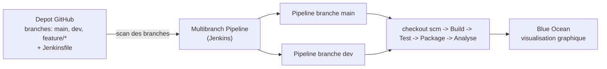

<a id="top"></a>

# Projet 4 — Examen : Pipeline Jenkins Multibranch + Blue Ocean (avec Docker)

> **Examen pratique** · Durée **2 h** · Module [05 — Jenkins : pipeline CI/CD](../README.md)
>
> **Objectif :** automatiser la **compilation**, les **tests unitaires** et la **livraison** d'un projet Java Maven avec un **pipeline Jenkins déclaratif**, organisé en **Multibranch Pipeline** et visualisé avec le plugin **Blue Ocean**.
>
> Pressé ? Voir l'**[aide-mémoire des commandes](COMMANDES.md)**.

---

## Ce qu'on construit

C'est la suite du [Projet 3 (Jenkins + Maven + tests)](../projet03-jenkins-maven-tests/README.md). On ajoute deux choses : un pipeline **Multibranch** (Jenkins découvre **tout seul** chaque branche du dépôt et lui crée un pipeline), et la visualisation **Blue Ocean** (interface graphique moderne des pipelines).



L'image Docker contient déjà **Jenkins + JDK 17 + Maven + Git + Blue Ocean** : aucun assistant d'installation, aucun plugin à installer à la main.

---

## Prérequis

- **Docker Desktop** installé et démarré.
- Un compte **GitHub** (+ un **jeton d'accès** si votre dépôt est privé).

```bash
docker --version
docker compose version
```

---

## Structure du projet

```text
projet04-jenkins-multibranch-blueocean/
├── docker-compose.yml          <- lance Jenkins (Blue Ocean inclus)
├── Dockerfile                  <- Jenkins + JDK 17 + Maven + plugins Blue Ocean
├── README.md                   <- ce fichier (l'enonce)
├── COMMANDES.md                <- aide-memoire
└── depot-exemple/              <- le projet Maven a mettre dans VOTRE depot GitHub
    ├── pom.xml
    ├── Jenkinsfile
    ├── .gitignore
    └── src/
        ├── main/java/com/exemple/App.java
        └── test/java/com/exemple/AppTest.java
```

---

## Étape 0 — Le projet Maven (déjà fourni)

Le dossier [`depot-exemple/`](depot-exemple) contient un projet Maven minimal **prêt à l'emploi** :

- `pom.xml` — `groupId` = `com.exemple`, `artifactId` = `demo-pipeline`, dépendance **JUnit 4.13.2**.
- `App.java` — une classe avec une méthode `addition(a, b)`.
- `AppTest.java` — trois tests unitaires JUnit.
- `Jenkinsfile` — le pipeline complet (voir plus bas).

> **Variante (pour comprendre) :** vous pouvez générer un projet équivalent avec un *archetype* Maven :
>
> ```bash
> mvn archetype:generate -DgroupId=com.exemple -DartifactId=demo-pipeline \
>     -DarchetypeArtifactId=maven-archetype-quickstart -DinteractiveMode=false
> ```
>
> Ici, le projet est déjà fourni : passez directement à l'étape 1.

---

## Étape 1 — Démarrer Jenkins (Blue Ocean inclus)

Dans ce dossier (`projet04-jenkins-multibranch-blueocean`) :

```bash
docker compose up -d --build
```

> Le premier build télécharge Jenkins + Maven + Blue Ocean : comptez quelques minutes.

Ouvrez ensuite **http://localhost:8080**.

> **Pas de mot de passe ?** C'est normal : l'assistant d'installation a été **désactivé** dans le `Dockerfile` (`runSetupWizard=false`) pour aller plus vite en classe. Jenkins s'ouvre directement sur le tableau de bord, avec **Blue Ocean déjà installé** (lien **« Open Blue Ocean »** dans le menu de gauche).
>
> Si le **port 8080 est occupé**, voir l'**[Annexe — Le port 8080 est déjà occupé ?](COMMANDES.md#annexe--le-port-8080-est-déjà-occupé-)** dans `COMMANDES.md`.

---

## Étape 2 — Créer votre dépôt GitHub

1. Créez un dépôt GitHub (ex. `demo-pipeline`).
2. Copiez-y **tout le contenu** du dossier [`depot-exemple/`](depot-exemple), en gardant la structure `src/main/...` et `src/test/...`.

```bash
cd depot-exemple
git init
git add .
git commit -m "Initial commit : projet Maven + Jenkinsfile"
git branch -M main
git remote add origin https://github.com/VOTRE-COMPTE/demo-pipeline.git
git push -u origin main
```

3. **Créez une deuxième branche** (pour démontrer le multibranch) :

```bash
git switch -c dev
git push -u origin dev
```

> Le `Jenkinsfile` utilise `checkout scm` : **aucune URL à modifier**. C'est Jenkins (Multibranch) qui injecte automatiquement la bonne branche.

---

## Étape 3 — Créer le pipeline Multibranch dans Blue Ocean

1. Menu de gauche → **Open Blue Ocean**.
2. **Create a new Pipeline**.
3. **Where do you store your code ?** → **GitHub** (ou **Git** pour une URL simple).
4. Si **GitHub** : collez un **jeton d'accès personnel** (Settings GitHub → Developer settings → Personal access tokens), puis choisissez votre organisation et le dépôt `demo-pipeline`.
   Si **Git** : collez l'URL `https://github.com/VOTRE-COMPTE/demo-pipeline.git` (+ credentials si privé).
5. **Create Pipeline**.

Jenkins **scanne le dépôt**, détecte le `Jenkinsfile` sur **chaque branche** (`main`, `dev`) et lance un pipeline pour chacune.

> Équivalent sans Blue Ocean : **New Item → Multibranch Pipeline → Branch Sources = Git/GitHub → Save**.

---

## Étape 4 — Lire les résultats dans Blue Ocean

Sur la page Blue Ocean du pipeline :

- chaque **branche** apparaît avec son dernier statut (vert = succès, rouge = échec) ;
- cliquez sur un build pour voir le **graphe des stages** : `Checkout → Build → Test → Package → Analyse` ;
- onglet **Tests** : les **3 tests JUnit** et leur statut (publiés par `junit '**/target/surefire-reports/*.xml'`) ;
- onglet **Artifacts** : le fichier `demo-pipeline-1.0-SNAPSHOT.jar` archivé (`archiveArtifacts`).

```text
Tests run: 3, Failures: 0, Errors: 0, Skipped: 0
BUILD SUCCESS
Finished: SUCCESS
```

---

## Le Jenkinsfile expliqué

Le pipeline ([`depot-exemple/Jenkinsfile`](depot-exemple/Jenkinsfile)) enchaîne les étapes demandées dans l'examen :

| Stage | Rôle | Commande clé |
|---|---|---|
| **Checkout** | Récupère la branche courante (auto en multibranch) | `checkout scm` |
| **Build** | Compile le code source | `mvn -B clean compile` |
| **Test** | Exécute les tests unitaires + publie le rapport | `mvn -B test` + `junit ...` |
| **Package** | Construit le JAR + l'archive | `mvn -B package` + `archiveArtifacts` |
| **Analyse** | Analyse statique Checkstyle (facultatif) | `mvn checkstyle:checkstyle` |

Points importants :

- **`checkout scm`** remplace un `git url: '...'` codé en dur : c'est la bonne pratique en Multibranch (la branche est injectée par Jenkins).
- **`-B`** = mode *batch* (sortie propre, non interactive).
- Le bloc **`post { always { junit ... } }`** publie le rapport de tests **même si un test échoue**.
- L'étape **Analyse** est entourée de **`catchError`** : une alerte de style ne fait **pas** échouer tout le pipeline.

> **Exercice noté :** dans `AppTest.java`, changez un résultat attendu (ex. `assertEquals(5, App.addition(2, 3))` → `6`), poussez sur la branche `dev`. Observez dans Blue Ocean : la branche `dev` passe **au rouge** alors que `main` reste **verte**. Remettez ensuite la bonne valeur.

---

## Barème indicatif (sur 20)

| Critère | Points |
|---|---|
| Projet Maven fonctionnel (`mvn clean test` passe) | 4 |
| `Jenkinsfile` complet (Checkout, Build, Test, Package) | 6 |
| Multibranch Pipeline créé et branches détectées | 4 |
| Rapport JUnit + artefact JAR visibles dans Blue Ocean | 3 |
| Étape Analyse / paramètre / capture d'écran | 3 |

---

## Livrables

- Le `Jenkinsfile` complet (dans le dépôt).
- Le projet Maven fonctionnel (`pom.xml`, sources, tests).
- Capture d'écran de **Blue Ocean** montrant les branches et un build vert.
- Rapport des tests, artefact JAR, rapport Checkstyle (si fait).

---

## Arrêter / réinitialiser

```bash
docker compose stop          # arreter (donnees conservees)
docker compose down          # supprimer le conteneur (volume conserve)
docker compose down -v       # tout supprimer (config Jenkins incluse)
```

---

<p align="center">
  <strong>Cours créé par Dr. Haythem REHOUMA — Développement et déploiement de solutions de données</strong>
</p>
